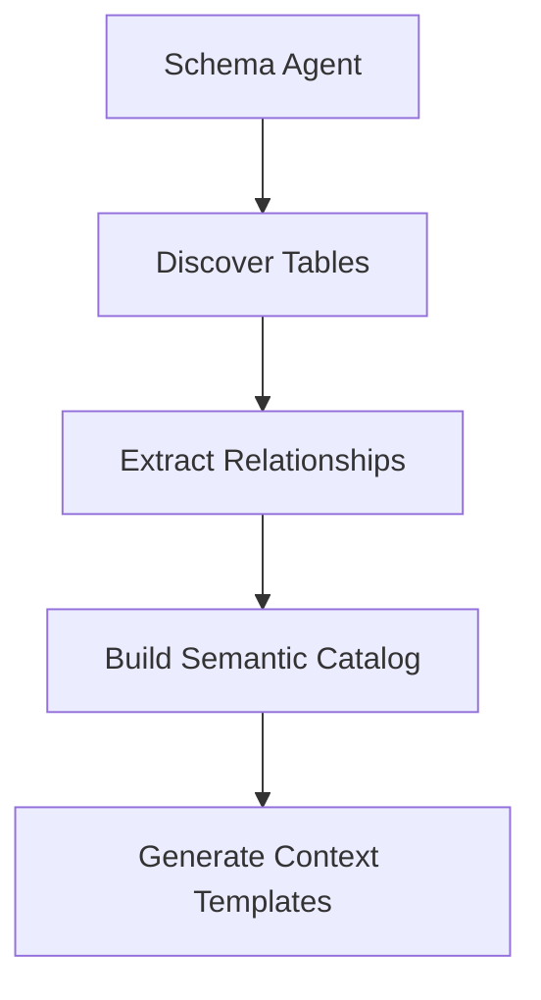
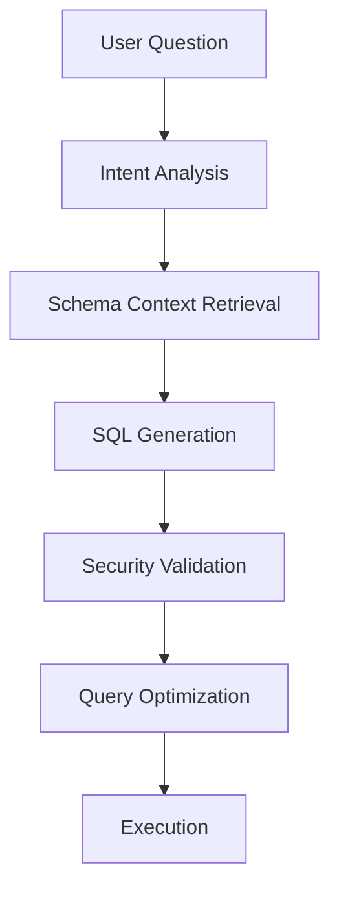
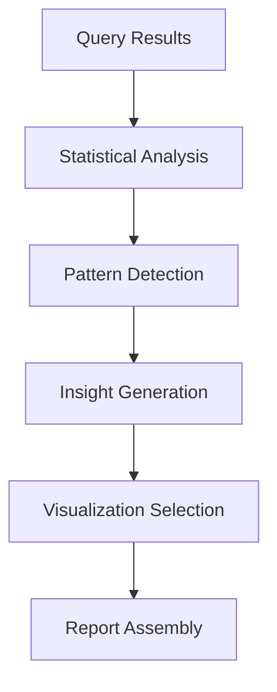

# GenBI - Agentic Natural Language Business Intelligence

## Overview

GenBI is an enterprise-grade, agentic business intelligence platform that transforms natural language questions into actionable insights through intelligent SQL generation and data analysis. Built with a sophisticated multi-agent architecture, it provides seamless integration with Snowflake data warehouses.

## Architecture

### Agent-Based Framework

The system implements a **multi-agent orchestration pattern** with specialized agents:

1. **Schema Agent** - Manages database schema discovery and catalog maintenance
2. **SQL Agent** - Generates and optimizes SQL queries from natural language
3. **Analysis Agent** - Interprets results and provides business insights
4. **Validation Agent** - Ensures query security and performance
5. **Orchestrator Agent** - Coordinates agent interactions and workflow execution

### Tool Ecosystem

Each agent leverages specialized tools:

- **Schema Tools**: Discovery, validation, relationship mapping
- **SQL Tools**: Generation, optimization, security validation
- **Analysis Tools**: Statistical analysis, trend detection, insight generation
- **Visualization Tools**: Chart recommendation, dashboard creation

## Key Features

### 🎯 Natural Language Processing
- Advanced prompt engineering with context-aware SQL generation
- Multi-turn conversation support with context preservation
- Domain-specific vocabulary and business rule understanding

### 🏗️ Enterprise Schema Management
- Automatic schema discovery and cataloging
- Relationship mapping and foreign key detection
- Semantic layer with business-friendly naming
- Version control for schema changes

### 🔒 Security & Governance
- Read-only query enforcement
- Role-based access control integration
- Query auditing and logging
- Data lineage tracking

### 📊 Intelligent Analytics
- Automated insight generation
- Statistical anomaly detection
- Trend analysis with business context
- Smart visualization recommendations

## Installation & Setup

### Prerequisites

- Python 3.11+
- Snowflake account with appropriate permissions
- OpenAI API key for GPT-4o access

### Environment Variables

```bash
# OpenAI Configuration
OPENAI_API_KEY=your_openai_api_key

# Snowflake Configuration
SNOWFLAKE_USER=your_username
SNOWFLAKE_PASSWORD=your_password
SNOWFLAKE_ACCOUNT=your_account_identifier
SNOWFLAKE_WAREHOUSE=your_warehouse
SNOWFLAKE_DATABASE=your_database
SNOWFLAKE_SCHEMA=your_schema
SNOWFLAKE_ROLE=your_role
```

### Quick Start

1. **Install Dependencies**
   ```bash
   pip install -r requirements.txt
   ```

2. **Configure Environment**
   - Set environment variables or use Replit secrets
   - Test Snowflake connection

3. **Launch Application**
   ```bash
   streamlit run app.py --server.port 5000
   ```

## Workflow Architecture

### 1. Schema Discovery Workflow



**Process:**
- Automated table and column discovery
- Foreign key relationship mapping
- Business rule extraction from comments
- Semantic naming convention application

### 2. Query Generation Workflow



**Process:**
- Natural language intent parsing
- Relevant schema context selection
- Multi-step SQL generation with validation
- Performance optimization suggestions

### 3. Analysis Workflow



**Process:**
- Automated statistical profiling
- Trend and anomaly detection
- Business context interpretation
- Interactive visualization creation

## Agent Specifications

### Schema Agent
**Purpose**: Database schema management and semantic understanding

**Capabilities:**
- Schema discovery and cataloging
- Relationship mapping
- Business rule extraction
- Semantic layer generation

**Tools:**
- `SchemaDiscoveryTool`: Automatic table/column detection
- `RelationshipMapperTool`: Foreign key and join path discovery
- `SemanticCatalogTool`: Business-friendly naming and descriptions
- `SchemaValidationTool`: Data quality and consistency checks

### SQL Agent
**Purpose**: Natural language to SQL translation

**Capabilities:**
- Context-aware SQL generation
- Query optimization
- Error handling and self-correction
- Security validation

**Tools:**
- `NLToSQLTool`: Advanced prompt-based SQL generation
- `QueryOptimizerTool`: Performance enhancement suggestions
- `SecurityValidatorTool`: Read-only enforcement
- `SyntaxCheckerTool`: SQL validation and correction

### Analysis Agent
**Purpose**: Data interpretation and insight generation

**Capabilities:**
- Statistical analysis
- Trend detection
- Business insight generation
- Report creation

**Tools:**
- `StatisticalAnalysisTool`: Descriptive and inferential statistics
- `TrendAnalysisTool`: Time series and pattern recognition
- `InsightGeneratorTool`: Business context interpretation
- `ReportBuilderTool`: Automated report assembly

## Configuration

### Schema Catalog Structure

```yaml
tables:
  - name: "SALES_FACT"
    business_name: "Sales Transactions"
    description: "Daily sales transaction records"
    columns:
      - name: "SALE_DATE"
        business_name: "Transaction Date"
        type: "DATE"
        description: "Date of the sales transaction"
      - name: "AMOUNT"
        business_name: "Sale Amount"
        type: "DECIMAL(10,2)"
        description: "Total transaction amount in USD"
    relationships:
      - type: "MANY_TO_ONE"
        target_table: "CUSTOMER_DIM"
        join_key: "CUSTOMER_ID"
```

### Agent Configuration

```yaml
agents:
  schema_agent:
    discovery_frequency: "daily"
    auto_refresh: true
    include_system_tables: false
  
  sql_agent:
    max_query_complexity: "high"
    timeout_seconds: 300
    optimization_level: "aggressive"
  
  analysis_agent:
    insight_depth: "comprehensive"
    statistical_confidence: 0.95
    trend_lookback_days: 90
```

## Usage Examples

### Basic Query
```
User: "What were our total sales last month?"

Agent Response:
- Generated SQL with date filtering
- Executed query against sales tables
- Provided formatted results with context
- Suggested follow-up analyses
```

### Complex Analysis
```
User: "Show me the top performing products by region with year-over-year growth"

Agent Response:
- Multi-table join query generation
- Year-over-year calculation logic
- Regional aggregation and ranking
- Visualization with growth trends
- Actionable business insights
```

## API Documentation

### REST Endpoints

```
POST /api/query
- Submit natural language question
- Returns: SQL query, results, analysis

GET /api/schema
- Retrieve schema catalog
- Returns: Table structures, relationships

POST /api/validate
- Validate SQL query
- Returns: Security, syntax, performance checks
```

### WebSocket Events

```
query.started - Query execution initiated
query.progress - Execution progress updates
query.completed - Results available
schema.updated - Schema catalog refreshed
```

## Monitoring & Observability

### Metrics Tracked
- Query execution times
- Success/failure rates
- Schema discovery frequency
- User interaction patterns

### Logging
- All queries logged with user context
- Error tracking with stack traces
- Performance metrics collection

## Security

### Query Security
- Read-only operation enforcement
- SQL injection prevention
- Access control integration

### Data Privacy
- No data storage outside Snowflake
- Encrypted API communications
- Audit trail maintenance

## Troubleshooting

### Common Issues

1. **Connection Failures**
   - Verify Snowflake credentials
   - Check network connectivity
   - Validate warehouse permissions

2. **Query Generation Errors**
   - Review schema catalog completeness
   - Check natural language clarity
   - Verify table/column naming

3. **Performance Issues**
   - Monitor query complexity
   - Review warehouse sizing
   - Check index utilization

## Contributing

### Development Setup
1. Fork repository
2. Create feature branch
3. Implement changes with tests
4. Submit pull request

### Testing
```bash
pytest tests/
pytest tests/integration/
```

## License

Enterprise License - Internal Use Only

## Support

For technical support and feature requests, contact the development team.